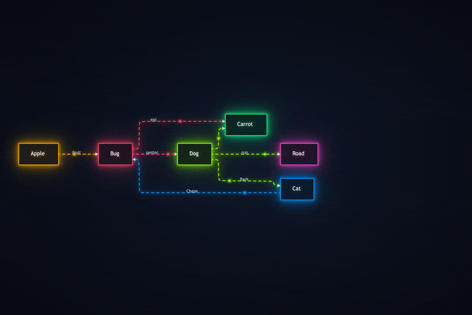

# jamaid

Convert FigJam flow diagrams into Mermaid 🧜‍♀️ flowcharts/markdown.

## Features

- Convert [FigJam](https://www.figma.com/figjam/) to [Mermaid](https://github.com/mermaid-js/mermaid) via Figma [REST API](https://developers.figma.com/docs/rest-api/file-endpoints/), [MCP](https://help.figma.com/hc/en-us/articles/32132100833559-Guide-to-the-Figma-MCP-server), or the [raw XML](https://developers.figma.com/docs/figma-mcp-server/tools-and-prompts/#get_figjam)/JSON
- Extract FigJam pages separately
- Output to PNG, SVG, or colorful animated HTML flow diagrams
- Auto arrange flow diagram nodes and connectors in different configurations for better comprehension
- Use it directly from the command-line or with a Claude Cowork/Code skill

<p align="center">
  
</p>

## Requirements

- Node.js 18+
- A [Figma API token](https://developers.figma.com/docs/rest-api/authentication/#access-tokens) with `file_content:read` scope for `--source rest|mcp|auto` (not required for `--source file|stdin`)

## Install

```bash
npm install
```

## Usage

```bash
# Output mermaid to stdout (single-page files)
npx tsx src/index.ts https://www.figma.com/board/ABC123/My-Board

# Explicit REST source (default behavior)
npx tsx src/index.ts ABC123 --source rest

# Auto source mode: tries MCP first, then falls back to REST
npx tsx src/index.ts ABC123 --source auto

# MCP source mode (requires MCP endpoint env var)
npx tsx src/index.ts ABC123 --source mcp

# JSON file source (REST payload)
npx tsx src/index.ts ./diagram-rest.json --source file --format rest

# File source (MCP XML payload)
npx tsx src/index.ts ./diagram-mcp.xml --source file --format mcp

# stdin source (input argument optional in stdin mode; supports JSON or MCP XML)
cat ./diagram.json | npx tsx src/index.ts --source stdin --format auto

# Multi-page files auto-export one output per page
npx tsx src/index.ts https://www.figma.com/board/ABC123/My-Board

# Save one selected page as .mmd file
npx tsx src/index.ts ABC123 --page 2 -o output.mmd

# Pass token inline (overrides FIGMA_API_TOKEN)
npx tsx src/index.ts ABC123 --token figd_xxx -o output.mmd

# Save as Markdown with fenced mermaid code block
npx tsx src/index.ts ABC123 --markdown

# Render as PNG image (requires mermaid-cli)
npx tsx src/index.ts ABC123 --png

# Render as SVG image (requires mermaid-cli)
npx tsx src/index.ts ABC123 --svg

# Render as animated neon-themed HTML (requires mermaid-cli)
npx tsx src/index.ts ABC123 --html

```

## CLI

```
jamaid [input] [options]

Arguments:
  input                    FigJam URL/file key or JSON file path (depends on --source)

Options:
  -o, --output <path>      Write output to file (overrides default filename)
  --token <token>          Figma API token (overrides FIGMA_API_TOKEN)
  --source <mode>          Source mode: rest, mcp, auto, file, stdin (default: rest)
  --format <format>        Input format for --source file|stdin: rest, mcp, auto (default: auto)
  --page <name-or-index>   Export only one page by name or 1-based index
  -d, --direction <dir>    Override direction: TD, LR, TB, BT, RL
  --layout <preset>        Layout preset: auto, default, compact, elk, organic, tree (default: auto)
  --markdown               Output as Markdown (.md) with fenced mermaid code block
  --png                    Output as PNG image (.png, requires mmdc)
  --svg                    Output as SVG image (.svg, requires mmdc)
  --html                   Output as animated neon-themed HTML (.html, requires mmdc)
  --ball-size <size>        HTML ball size: small, medium, large (default: medium)
  --theme <theme>           HTML theme: neon, pastel, ocean, sunset, spectrum, vivid, candy, forest (default: neon)
  --no-glow                 Disable halo glow effects in HTML output
  --color-mode <mode>       HTML color mode: cluster, random (default: cluster)
  -h, --help               Display help
```

### Output Formats

| Flag         | Output          | Default Filename         |
| ------------ | --------------- | ------------------------ |
| _(none)_     | Raw mermaid to stdout | —                  |
| `-o <path>`  | Raw mermaid to file   | As specified       |
| `--markdown` | Fenced mermaid in Markdown | `<figjam-name>.md` |
| `--png`      | PNG image                  | `<figjam-name>.png` |
| `--svg`      | SVG image                  | `<figjam-name>.svg` |
| `--html`     | Animated neon-themed HTML  | `<figjam-name>.html` |

For `--markdown`, `--png`, `--svg`, and `--html`, the filename is derived from the FigJam file/page name (`<figjam-name>-<page-name>.<ext>`).
Use `-o custom.ext` only when exporting a single page (`--page ...`).

### Animated Neon HTML (`--html`)

The `--html` flag generates a self-contained HTML file with an animated neon-themed diagram. Open it in any browser — no server required.

Features:

- **Dark cyberpunk background** with radial gradient
- **Auto-colored subgraphs** — each subgraph gets a distinct neon hue (green, blue, amber, cyan, purple, etc.)
- **Glowing nodes** — multi-layered CSS `drop-shadow` glow halos on every node
- **Animated marching-ant connectors** — dashed edges with flowing dash animation
- **Traveling glow balls** — luminous orbs that travel along each connector path via `requestAnimationFrame`
- **Color-coded edges** — connector color matches the source node's subgraph
- **Text glow** — node labels emit a subtle neon glow matching their group color

The HTML is fully self-contained (no external dependencies) and works offline.

```bash
# From a FigJam file
jamaid ABC123 --html

# With page selection
jamaid ABC123 --html --page "Architecture"

# Custom output path
jamaid ABC123 --html --page 1 -o my-diagram.html
```

#### Ball Size (`--ball-size`)

Control the size of the traveling glow balls on connectors.

| Value    | Radius | Glow blur |
| -------- | ------ | --------- |
| `small`  | 3px    | 3px       |
| `medium` | 5px    | 5px       |
| `large`  | 6px    | 6px       |

```bash
jamaid ABC123 --html --ball-size small
jamaid ABC123 --html --ball-size large
```

#### Themes (`--theme`)

Choose from eight color themes that control background, node fills, text colors, glow intensity, and the color palette.

| Theme | Background | Palette |
| ----- | ---------- | ------- |
| `neon` | Dark cyberpunk |         |
| `pastel` | Dark muted |         |
| `ocean` | Light blue |         |
| `sunset` | Light warm |         |
| `spectrum` | Dark neutral |         |
| `vivid` | Dark deep |         |
| `candy` | Dark purple |         |
| `forest` | Dark earthy |         |

**Dark themes:** `neon`, `pastel`, `spectrum`, `vivid`, `candy`, `forest` — glow-forward on dark backgrounds.  
**Light themes:** `ocean`, `sunset` — automatically reduce glow intensity and ball opacity for readability.  
**High-contrast themes:** `spectrum`, `vivid`, `candy` — designed for maximum visual differentiation between clusters.

```bash
jamaid ABC123 --html --theme spectrum
jamaid ABC123 --html --theme vivid
jamaid ABC123 --html --theme candy
jamaid ABC123 --html --theme forest
```

#### Color Mode (`--color-mode`)

Control how colors are assigned to individual nodes.

- **`cluster`** (default) — All nodes in the same subgraph share one color. Matches the subgraph border color.
- **`random`** — Each node gets a distinct color from the theme palette via deterministic hashing. Subgraph borders still keep their own cluster color.

```bash
# Every node gets its own color
jamaid ABC123 --html --color-mode random

# Combine with a theme
jamaid ABC123 --html --theme sunset --color-mode random --ball-size small
```

#### Glow Toggle (`--no-glow`)

Disable all halo glow effects (node glows, edge glows, text shadows, ball glow filters). Nodes and edges still render with their theme colors — only the glow halos are removed.

```bash
# Clean look, no glow halos
jamaid ABC123 --html --no-glow

# Combine with any theme
jamaid ABC123 --html --theme spectrum --no-glow
```

### Layout Presets (`--layout`)

Control how nodes and connectors are arranged in rendered output (PNG, SVG, HTML). Defaults to `auto`, which analyzes the graph structure and picks the best layout automatically.

| Preset    | Engine       | Best for                                      |
| --------- | ------------ | --------------------------------------------- |
| `auto`    | _(varies)_   | Let jamaid pick based on graph analysis        |
| `default` | Dagre        | Small, simple diagrams (<10 nodes)             |
| `compact` | Dagre        | Large sparse graphs — tighter spacing          |
| `elk`     | ELK layered  | Diagrams with many subgraphs/sections          |
| `organic` | ELK stress   | Dense, heavily connected graphs                |
| `tree`    | ELK mrtree   | Tree-shaped flows (each node has ≤1 parent)    |

**Auto-detection heuristics:**

The `auto` preset examines each page's graph before rendering:

- **Node count** — small (<10), medium, or large (30+)
- **Edge density** — edges÷nodes ratio (sparse vs heavily connected)
- **Max fan-out** — highest number of outgoing edges from any single node
- **Section count** — number of subgraphs/clusters
- **Tree shape** — whether every node has at most one incoming edge

```bash
# Auto-detect (default, no flag needed)
jamaid ABC123 --png

# Force a specific layout
jamaid ABC123 --svg --layout elk
jamaid ABC123 --html --layout organic
jamaid ABC123 --png --layout compact
```

ELK-based presets (`elk`, `organic`, `tree`) require mermaid-cli with ELK support, which is included in recent versions of `@mermaid-js/mermaid-cli`.

### Source Modes

- `--source rest`: Use Figma REST API ingestion (default).
- `--source mcp`: Use MCP HTTP transport ingestion.
- `--source auto`: Try MCP first; on MCP unavailability, network `TypeError`, timeout, or 5xx endpoint errors, fallback to REST automatically.
- `--source file`: Read payload from file path in `<input>` (REST JSON or MCP XML).
- `--source stdin`: Read payload from stdin (REST JSON or MCP XML; positional `<input>` is optional and ignored if provided).

If `--source` is omitted, jamaid behaves exactly like prior versions and uses REST only.

For `--source file|stdin`, use `--format` to choose the payload contract:

- `--format rest`: Validate payload as Figma REST `/files` JSON shape (`document` root).
- `--format mcp`: Validate payload as MCP XML (`get_figjam`).
- `--format auto` (default): Auto-detect payload shape:
  - MCP XML when payload starts with `<`.
  - REST JSON when payload has `document` object and Figma-like node structure (`document.id`, `document.type`).
  - otherwise returns an actionable error instructing `--format rest|mcp`.

### Which Source Should I Use?

- **Use `--source rest` when you have a Figma Professional plan with Dev Mode access.**
  - Figma REST is generally the simplest integration, but can be heavily throttled without the right plan/features.
- **Use `--source mcp` when connecting jamaid into AI workflows that don't natively support MCP connections.**
  - jamaid can call an MCP endpoint and convert the XML result into Mermaid output.
- **Use `--source file --format mcp` (or `--source stdin --format mcp`) when you already captured MCP XML output** from tools like Claude Code/Cowork and want to convert it offline.
  - This is useful for Claude skills/scripts where you want to avoid passing a Figma API token directly into jamaid.

### MCP Configuration

Set these env vars to enable `--source mcp` (or `--source auto` MCP-first behavior):

- `JAMAID_MCP_ENDPOINT_URL` (required): HTTP endpoint that returns MCP XML payload from `get_figjam`.
- `JAMAID_MCP_AUTH_TOKEN` (optional): bearer token sent as `Authorization: Bearer <token>`.
- `JAMAID_MCP_TIMEOUT_MS` (optional): request timeout in milliseconds (default: `10000`).

If `JAMAID_MCP_ENDPOINT_URL` is not set, `--source mcp` fails with an actionable error and `--source auto` falls back to REST.

MCP response payload contract: XML response from `get_figjam`.

### Multi-page behavior

- If a file has multiple pages and you do **not** pass `--page`, jamaid writes one output file per page.
- If you pass `--page`, jamaid exports only that page (and supports `-o`).
- `--page` accepts either a 1-based index (`--page 2`) or exact page name (`--page "Discovery Flow"`).

**PNG/SVG rendering** requires [mermaid-cli](https://github.com/mermaid-js/mermaid-cli):

```bash
npm i -g @mermaid-js/mermaid-cli
```


### Token Lookup

Token resolution applies only to `--source rest|mcp|auto`.  
`--source file|stdin` does not require a Figma token.

Precedence:

1. `--token` flag
2. `FIGMA_API_TOKEN` from process env (includes local `.env` via dotenv)
3. `~/code/_secret/.env`

See `.env.example` for reference.

## Development

```bash
npm run test
npm run typecheck
npm run build
```

## Project Structure

```
jamaid/
├── src/
│   ├── index.ts      # CLI entry point
│   ├── figma.ts      # Figma API client
│   ├── pipeline.ts   # ingest/normalize/transform/render pipeline
│   ├── normalizer.ts # source payload -> canonical graph document
│   ├── cli-options.ts # CLI source/format parsing + validation
│   ├── parser.ts     # Figma JSON → intermediate representation
│   ├── layout.ts     # Layout preset detection & mermaid config
│   ├── mermaid.ts    # Intermediate repr → Mermaid syntax
│   ├── neon-html.ts  # Animated neon-themed HTML generator
│   ├── types.ts      # TypeScript + canonical graph types
│   └── sources/
│       ├── diagram-source.ts
│       ├── mcp-http-client.ts
│       ├── figma-rest-source.ts
│       ├── figma-mcp-source.ts
│       ├── file-json-source.ts
│       ├── stdin-json-source.ts
│       ├── json-payload.ts
│       └── select-source.ts
├── tests/
│   ├── parser.test.ts
│   ├── mermaid.test.ts
│   ├── source-selection.test.ts
│   ├── figma-mcp-source.test.ts
│   ├── normalizer-mcp.test.ts
│   ├── cli-options.test.ts
│   ├── json-input-sources.test.ts
│   └── layout.test.ts
├── .env.example
├── package.json
├── tsconfig.json
└── README.md
```
